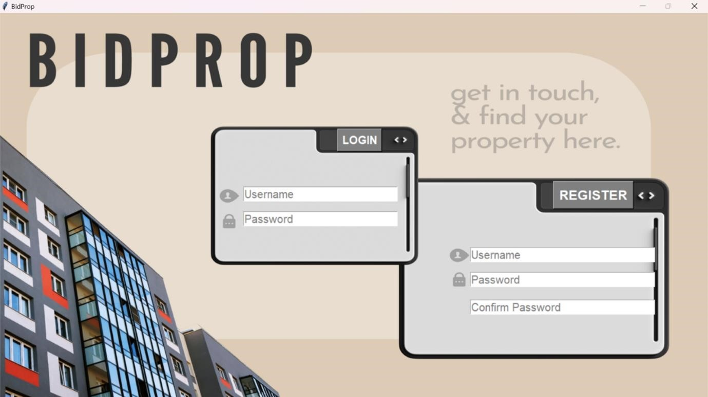
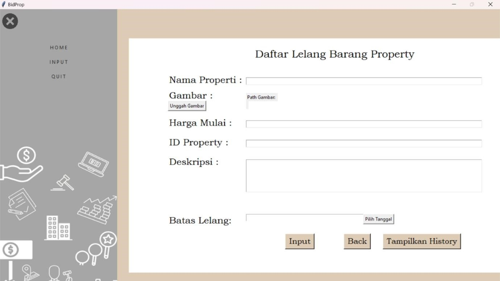
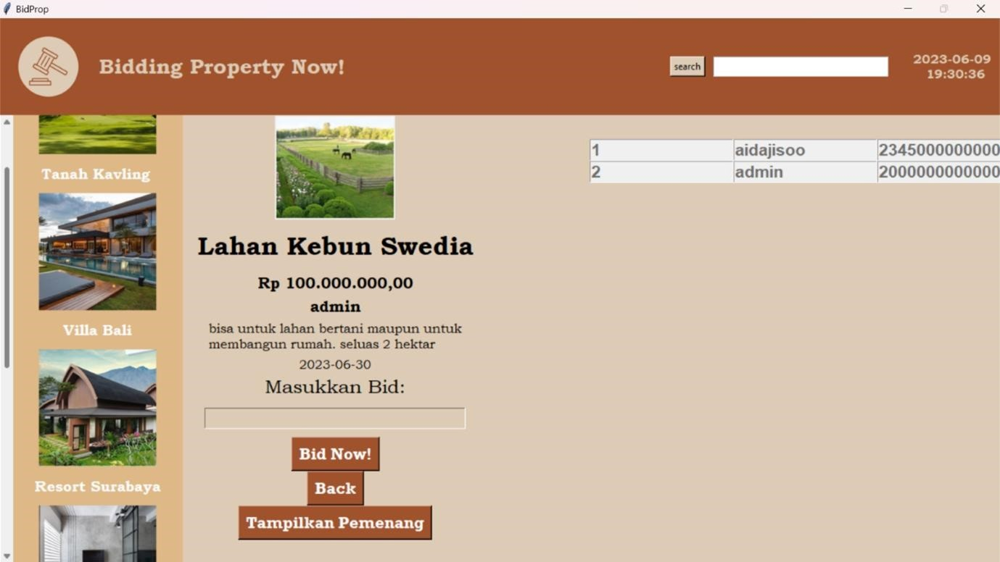
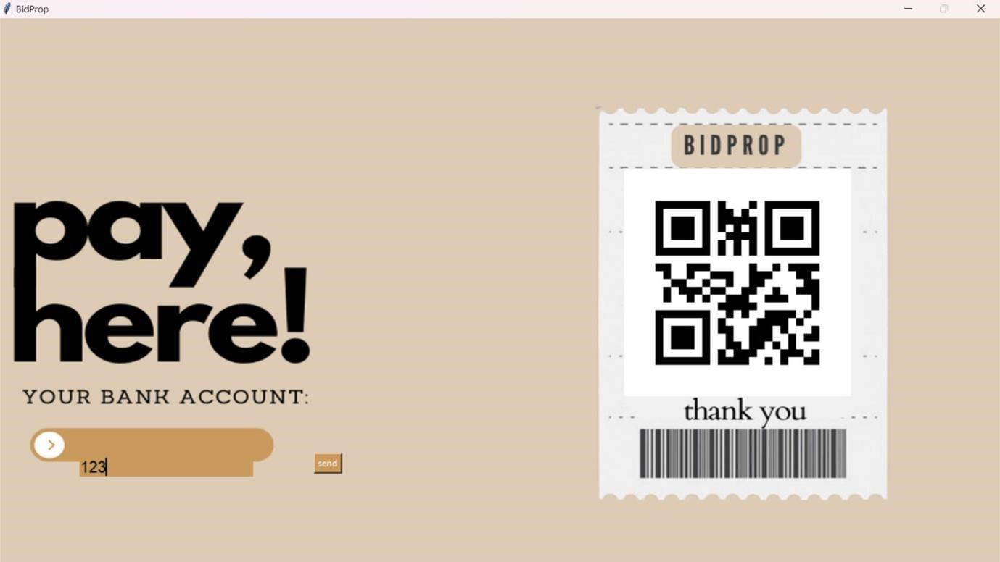

# Sistem Lelang Properti (BIDPROP)

## Deskripsi
BIDPROP adalah sistem lelang properti berbasis digital yang dikembangkan sebagai proyek mata kuliah Struktur Data dan Algoritma. Sistem ini memungkinkan pengguna untuk melihat, mencari, dan menawar properti yang dilelang secara online dengan efisiensi tinggi.

## Fitur Utama
- **Manajemen Properti** menggunakan struktur data *linked list*.
- **Sorting Properti** menggunakan *comb sort* untuk mengurutkan daftar properti.
- **Pencarian Properti** menggunakan *linear search* berdasarkan kriteria tertentu.
- **Proses Lelang Transparan** yang memungkinkan pengguna melihat tawaran tertinggi secara berkala.

## Tools dan Algoritma yang Digunakan
- Bahasa Pemrograman: Python
- Struktur Data: *Linked List*
- Algoritma Sorting: *Comb Sort*
- Algoritma Searching: *Linear Search*

## Graphical User Interface
Berikut adalah tampilan antarmuka dari sistem Lelang Properti BIDPROP:

